#  Infrastruktur Prism ERP <a href="https://github.com/Lumina-Enterprise-Solutions/infra-prism"></a>

Selamat datang di repositori infrastruktur untuk **Prism ERP**. Repositori ini berisi semua konfigurasi yang diperlukan untuk menjalankan seluruh tumpukan _backend_ Prism ERP, baik secara lokal untuk pengembangan maupun di lingkungan produksi, menggunakan Docker Compose.

Arsitektur ini dirancang sebagai _microservices_, dengan semua komponen yang diperlukan untuk pengembangan, pengujian, pemantauan, dan penerapan.

---

## ✨ Fitur & Komponen Inti

Tumpukan infrastruktur kami kaya akan fitur dan dibangun di atas teknologi terdepan:

-   🐳 **Kontainerisasi**: Seluruh tumpukan aplikasi didefinisikan dalam `docker-compose.yml` untuk portabilitas dan konsistensi.
-   🔀 **API Gateway Cerdas**: [Traefik](httpsa://traefik.io/traefik/) sebagai _reverse proxy_ dan API gateway, menangani perutean, keamanan, dan _rate limiting_.
-   **Broker Pesan**: [RabbitMQ](https://www.rabbitmq.com/) untuk komunikasi asinkron dan arsitektur berbasis peristiwa (event-driven).
-   🗃️ **Penyimpanan Data Poliglot**: PostgreSQL (Relasional), Redis (Cache), dan [Minio](https://min.io/) (Object Storage S3) untuk kebutuhan data yang beragam.
-   🔑 **Manajemen Konfigurasi & Rahasia**: [Consul](https://www.consul.io/) untuk konfigurasi dinamis dan [HashiCorp Vault](https://www.vaultproject.io/) untuk manajemen rahasia yang aman.
-   🔭 **Tumpukan Observabilitas Lengkap**:
    -   [Prometheus](https://prometheus.io/) untuk pengumpulan metrik.
    -   [Grafana](https://grafana.com/) untuk visualisasi dan dasbor.
    -   [Loki](https://grafana.com/oss/loki/) untuk agregasi log.
    -   [Jaeger](https://www.jaegertracing.io/) untuk _distributed tracing_.
-   🤖 **Otomatisasi Alur Kerja**: `Makefile` yang intuitif untuk menyederhanakan perintah-perintah umum.
-   🔄 **CI/CD Terintegrasi**: Pipeline GitHub Actions untuk pengujian otomatis (unit, integrasi, E2E) dan penerapan ke server pengembangan.

---

## 🏗️ Sekilas Arsitektur

Permintaan pengguna mengalir melalui Traefik API Gateway, yang kemudian mengarahkannya ke microservice yang sesuai. Layanan dapat berkomunikasi secara sinkron (gRPC) atau asinkron melalui RabbitMQ.

```mermaid
graph TD
    subgraph "🌐 Client Layer"
        A[📱 User<br/>Web/Mobile App]
    end

    subgraph "🐳 Infrastruktur Prism (Jaringan Docker)"
        A --> B{🚪 Traefik API Gateway<br/>Load Balancer & Reverse Proxy};

        subgraph "⚙️ Microservices Inti"
            B --> C[🔐 Auth Service<br/>JWT, SSO SAML, OAuth2];
            B --> D[👤 User Service<br/>Profil, RBAC, ABAC, Tim];
            B --> E[📁 File Service<br/>Upload, Download, CDN];
            B --> F[📨 Invitation Service<br/>Manajemen Undangan];
            G[🔔 Notification Service<br/>Email, WebSocket];
        end

        subgraph "📨 Message Broker"
            H[🐇 RabbitMQ<br/>Event Bus]
        end

        subgraph "💾 Penyimpanan Data"
            I[(🐘 PostgreSQL<br/>Database Utama)]
            J[(⚡ Redis Cache<br/>Session & Token Store)]
            K[(📦 MinIO S3<br/>Object Storage)]
        end

        subgraph "🔧 Manajemen & Keamanan"
            L[🔒 Vault<br/>Secret Management]
            M[⚙️ Consul<br/>Service Discovery & Config]
        end

        subgraph "📊 Observabilitas"
            N[📊 Grafana<br/>Dashboards]
            O[📈 Prometheus<br/>Metrics]
            P[📋 Loki<br/>Logs]
            Q[🔍 Jaeger<br/>Tracing]
        end

        %% Flow Sinkron
        C --> D;
        D --> C;
        D --> E;

        %% Flow Asinkron (Event-Driven)
        F -- Event 'InvitationCreated' --> H;
        E -- Event 'ImageUploaded' --> H;
        H -- Event 'SendEmail' --> G;

        %% Koneksi ke Data Layer
        C --> I & J;
        D --> I & L & M;
        E --> I & K;
        F --> J;

        %% Koneksi ke Manajemen & Observabilitas
        C & D & E & F & G --> L & M;
        C & D & E & F & G --> N & O & P & Q;
    end

    %% Styling untuk membuat diagram lebih menarik
    classDef database fill:#e1f5fe,stroke:#01579b,stroke-width:3px,color:#000
    classDef cache fill:#ffebee,stroke:#c62828,stroke-width:3px,color:#000
    classDef service fill:#f3e5f5,stroke:#7b1fa2,stroke-width:3px,color:#000
    classDef storage fill:#e8f5e8,stroke:#2e7d32,stroke-width:3px,color:#000
    classDef gateway fill:#fff3e0,stroke:#f57c00,stroke-width:3px,color:#000
    classDef security fill:#fce4ec,stroke:#ad1457,stroke-width:3px,color:#000
    classDef monitoring fill:#f1f8e9,stroke:#558b2f,stroke-width:3px,color:#000
    classDef user fill:#e3f2fd,stroke:#1565c0,stroke-width:3px,color:#000

    class G database
    class H cache
    class I storage
    class J storage
    class C,D,E,F service
    class B gateway
    class K,L service
    class M,N,O,P monitoring
    class Q,R,S security
    class A user
```



---

## 🚀 Memulai

Hanya butuh beberapa menit untuk menjalankan seluruh ekosistem di mesin lokal Anda.

### Prasyarat
Pastikan perangkat Anda telah terinstal:
-   [Docker](https://www.docker.com/get-started) & [Docker Compose](https://docs.docker.com/compose/install/)
-   `make` (standar di Linux/macOS, dapat diinstal via [Chocolatey](https://chocolatey.org/packages/make) di Windows)

### Langkah-langkah Instalasi

1.  **Clone Repositori**:
    ```bash
    git clone https://github.com/Lumina-Enterprise-Solutions/infra-prism.git
    cd prism-erp/infra
    ```

2.  **Konfigurasi Lingkungan**:
    Salin file `.env.example` menjadi `.env`. Nilai default sudah cocok untuk lingkungan lokal.
    ```bash
    cp .env.example .env
    ```

3.  **Jalankan Semuanya!**:
    Gunakan `Makefile` untuk membangun dan menjalankan semua layanan.

    *   **Untuk Pengembangan (Lokal)**: Perintah ini akan membangun _image_ dari kode sumber di monorepo Anda.
        ```bash
        make local-up
        ```

    *   **Untuk Staging/Produksi**: Perintah ini akan menarik _image_ yang sudah jadi dari _container registry_ (misal: GHCR).
        ```bash
        make prod-up
        ```

---

## 🛠️ Perintah `Makefile` yang Paling Berguna

Gunakan perintah ini dari direktori `infra` untuk mengelola lingkungan Anda.

| Perintah | Deskripsi |
| :--- | :--- |
| `make help` | 💬 Menampilkan semua perintah yang tersedia. |
| `make local-up` | 🚀 **[LOKAL]** Memulai semua layanan untuk pengembangan. |
| `make local-down` | ⏹️ **[LOKAL]** Menghentikan dan menghapus kontainer lokal. |
| `make local-restart` | 🔄 **[LOKAL]** Memulai ulang semua layanan lokal. |
| `make local-logs` | 📜 **[LOKAL]** Menampilkan log dari semua layanan. Gunakan `s=<nama_service>` untuk filter. |
| `make local-clean` | 🧹 **[LOKAL] HATI-HATI!** Menghentikan layanan dan menghapus **semua volume data**. |
| `make local-migrate-up` | ⬆️ **[LOKAL]** Menerapkan semua migrasi database. |
| `make prod-up` | 🚀 **[PROD]** Memulai semua layanan untuk produksi. |
| `make prod-down` | ⏹️ **[PROD]** Menghentikan dan menghapus kontainer produksi. |
| `make prod-clean` | 🧹 **[PROD] SANGAT BERBAHAYA!** Menghapus semua data produksi. |

---

## 🌐 Mengakses Layanan

Memperbarui daftar dengan layanan baru dan port yang relevan.

| Layanan | URL | Kredensial (jika ada) |
| :--- | :--- | :--- |
| **API Aplikasi** | `http://localhost:8000` | - |
| **Grafana** | `http://localhost:3000` | `admin` / `admin` |
| **Dasbor Traefik** | `http://localhost:8081` | - |
| **Jaeger Tracing** | `http://localhost:16686` | - |
| **Prometheus** | `http://localhost:9090` | - |
| **Vault UI** | `http://localhost:8200` | Token: `root-token-for-dev` |
| **Consul UI** | `http://localhost:8500` | - |
| **RabbitMQ UI** | `http://localhost:15672` | `guest` / `guest` |
| **Konsol MinIO** | `http://localhost:9001` | `minioadmin` / `minioadmin` |


---

## 📦 Integrasi Monorepo

Konfigurasi `docker-compose.local.yml` dirancang untuk bekerja dalam struktur monorepo. Perhatikan bagian `build` di setiap layanan aplikasi, yang mengarah ke direktori kode sumber layanan terkait.

```yaml
# contoh di user-service dalam docker-compose.local.yml
services:
  user-service:
    build:
      context: .. # Mundur satu direktori ke root monorepo
      dockerfile: services/prism-user-service/Dockerfile.mono
```

---

## 📖 Dokumentasi Lanjutan

Untuk panduan yang lebih mendalam tentang arsitektur, konfigurasi, dan alur kerja, silakan kunjungi **[Wiki Repositori](https://github.com/Lumina-Enterprise-Solutions/infra-prism/wiki)** kami.
